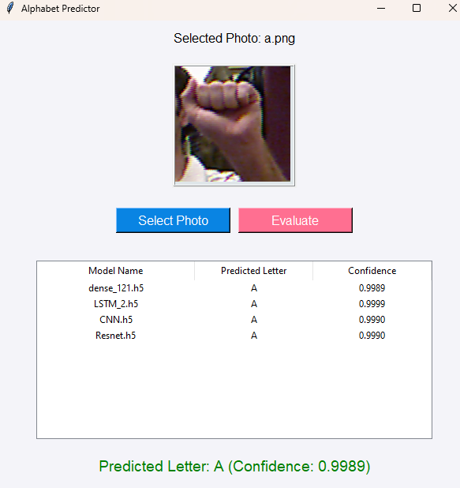

# ASL Alphabet Predictor - Deep Learning Project

## Overview

The **ASL Alphabet Predictor** is a **Tkinter-based GUI application** that leverages **Deep Learning** to recognize and classify **American Sign Language (ASL) finger-spelled letters** from images. Multiple models (**DenseNet, LSTM, CNN, ResNet**) are evaluated, and predictions are displayed along with confidence scores.

## Features

- **Image-based ASL Letter Prediction** using Deep Learning models.
- **Multiple Model Comparisons** - Evaluates results from different architectures.
- **User-friendly GUI** built with Tkinter.
- **Confidence Score Display** for each model.
- **Real-time Image Selection** and preview.
- **Supports Multiple Models** - Densenet, LSTM, CNN, and ResNet.

## Technologies Used

- **Python** - Backend programming.
- **TensorFlow/Keras** - Deep Learning models.
- **Tkinter** - GUI Development.
- **Pillow (PIL)** - Image processing.
- **NumPy** - Numerical operations.
- **OpenCV** - Image preprocessing (optional).

## Installation

### Prerequisites:
Ensure you have Python installed. Then install dependencies:
```bash
pip install tensorflow numpy pillow opencv-python tkinter
```

### Clone Repository:
```bash
git clone https://github.com/yourusername/asl-alphabet-predictor.git
cd asl-alphabet-predictor
```

## How to Run
```bash
python asl_predictor.py
```

## How to Use

1. **Select a Photo**: Click "Select Photo" to upload an image.
2. **Evaluate Models**: Click "Evaluate" to classify the letter.
3. **View Predictions**: See the predicted letter and confidence scores from different models.
4. **Restart**: Select another image and repeat.

## GUI




---
**Bridging communication gaps with AI!**

